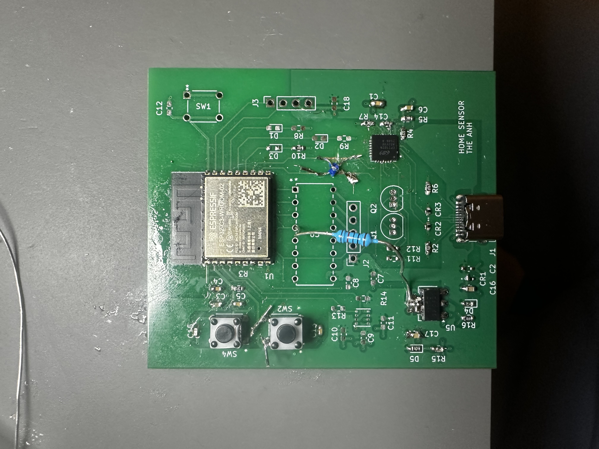

# ESP32-C3 WROOM-02 Custom Board Hardware Bring-up

troubleshooting steps and hardware corrections required to run an ESP32-C3-WROOM-02 module on custom PCB

## Hardware Corrections (Lessons Learned)

the following hardware issues were identified and corrected:

- UART TX/RX Swap: The communication lines between the USB-to-UART bridge and the ESP32-C3 (GPIO 20 & 21) were originally swapped.
- Missing GPIO 8 Pull-up: GPIO 8 is a strapping pin for the ESP32-C3 was floating6
- changed C14 for 1k Ohm 

